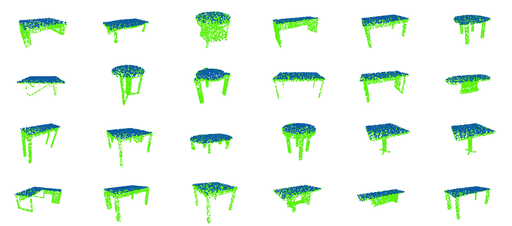
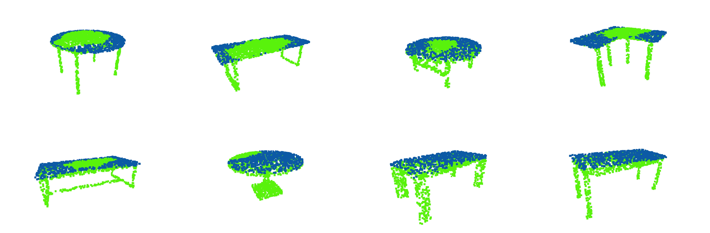

# PointNet Plane Detection

In this experiment, based on the implementation of [PointNet](https://github.com/charlesq34/pointnet), we tried to explore the potential of neural network models for some more specific tasks on point clouds, e.g., 3D plane detection.

## Experimental Data

64 tables from the [ShapeNetPart](web.stanford.edu/~ericyi/project_page/part_annotation/
) dataset were selected for training and 8 for testing, each of which has a significant planar surface. The picture below shows a part of the training set. For the training data, the points on the plane are labeled manually.

## Testing Result

The network was trained for 100 epochs and a result of an accuracy around 85% was derived. The plane detection result on the testing set is as below.

The result shows a few interesting patterns in it. The model seems to favor a table with a more normal shape, i.e., a table with a square tabletop and four straight legs. For tables without a regular shape, the classification accuracy is relatively lower, and the model tends to misclassify the points in the middle of tabletop.

For the very specific plane detection problem, such misclassification issue does not matter much, as we can apply a [3D Hough transformation](https://link.springer.com/article/10.1007/3DRes.02%282011%293) afterwards on the detected planar part, which is robust towards missing and contaminated data, to generate the plane information.
